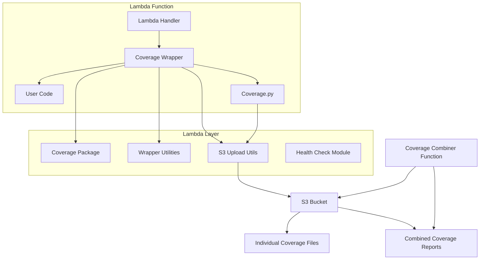
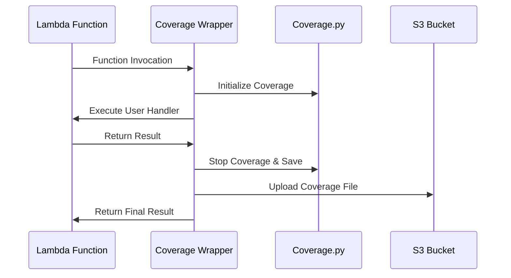

# Design Document

## Overview

The Lambda Coverage Layer is a Python-based AWS Lambda layer that provides automated code coverage tracking capabilities for Lambda functions. The layer integrates the Python `coverage.py` package to collect coverage data during function execution, automatically uploads coverage reports to S3, and provides utilities for combining multiple coverage reports into consolidated reports.

The solution consists of three main components:
1. **Coverage Layer**: A Lambda layer containing the coverage package and wrapper utilities
2. **Coverage Wrapper**: Python modules that automatically initialize and finalize coverage tracking
3. **Coverage Combiner**: A utility function for merging multiple coverage files into a single report

## Architecture

### High-Level Architecture



### Component Architecture

#### 1. Coverage Layer Structure
```
python/
├── coverage/                    # coverage.py package and dependencies
├── coverage_wrapper/           # Custom wrapper modules
│   ├── __init__.py
│   ├── wrapper.py             # Main coverage wrapper
│   ├── s3_uploader.py         # S3 upload utilities
│   ├── health_check.py        # Health check endpoint
│   └── combiner.py            # Coverage combining utilities
└── requirements.txt           # Layer dependencies
```

#### 2. Coverage Wrapper Flow


## Components and Interfaces

### 1. Coverage Wrapper Module (`coverage_wrapper/wrapper.py`)

**Purpose**: Provides decorators and context managers for automatic coverage tracking.

**Key Functions**:
- `@coverage_handler`: Decorator for Lambda handlers
- `CoverageContext`: Context manager for manual coverage control
- `initialize_coverage()`: Sets up coverage tracking
- `finalize_coverage()`: Stops tracking and uploads to S3

**Interface**:
```python
from coverage_wrapper import coverage_handler, CoverageContext

@coverage_handler
def lambda_handler(event, context):
    # User code here
    return response

# Or manual control
def lambda_handler(event, context):
    with CoverageContext():
        # User code here
        return response
```

### 2. S3 Uploader Module (`coverage_wrapper/s3_uploader.py`)

**Purpose**: Handles uploading coverage files to S3 with proper naming and error handling.

**Key Functions**:
- `upload_coverage_file()`: Uploads coverage data to S3
- `generate_s3_key()`: Creates S3 key with timestamp and function name
- `get_s3_config()`: Retrieves S3 configuration from environment variables

**Configuration**:
- `COVERAGE_S3_BUCKET`: S3 bucket name (required)
- `COVERAGE_S3_PREFIX`: S3 key prefix (optional, default: "coverage/")
- `COVERAGE_UPLOAD_TIMEOUT`: Upload timeout in seconds (optional, default: 30)

### 3. Health Check Module (`coverage_wrapper/health_check.py`)

**Purpose**: Provides health check endpoint functionality for Lambda functions.

**Key Functions**:
- `health_check_handler()`: Returns health status with coverage info
- `get_coverage_status()`: Checks if coverage is properly initialized
- `get_layer_info()`: Returns layer version and configuration details

**Response Format**:
```json
{
    "status": "healthy",
    "coverage_enabled": true,
    "layer_version": "1.0.0",
    "s3_config": {
        "bucket": "my-coverage-bucket",
        "prefix": "coverage/"
    },
    "timestamp": "2024-01-15T10:30:00Z"
}
```

### 4. Coverage Combiner Module (`coverage_wrapper/combiner.py`)

**Purpose**: Combines multiple coverage files into a single consolidated report.

**Key Functions**:
- `combine_coverage_files()`: Downloads and combines coverage files from S3
- `download_coverage_files()`: Downloads all coverage files from S3 prefix
- `merge_coverage_data()`: Merges coverage data using coverage.py combine functionality
- `upload_combined_report()`: Uploads combined report back to S3

**Usage**:
```python
from coverage_wrapper.combiner import combine_coverage_files

def coverage_combiner_handler(event, context):
    result = combine_coverage_files(
        bucket_name=event['bucket'],
        prefix=event.get('prefix', 'coverage/'),
        output_key=event.get('output_key', 'coverage/combined-report.json')
    )
    return result
```

## Data Models

### 1. Coverage Configuration
```python
@dataclass
class CoverageConfig:
    s3_bucket: str
    s3_prefix: str = "coverage/"
    upload_timeout: int = 30
    include_patterns: List[str] = None
    exclude_patterns: List[str] = None
    branch_coverage: bool = True
```

### 2. Coverage Report Metadata
```python
@dataclass
class CoverageReportMetadata:
    function_name: str
    execution_id: str
    timestamp: datetime
    s3_key: str
    file_size: int
    coverage_percentage: float
```

### 3. Health Check Response
```python
@dataclass
class HealthCheckResponse:
    status: str  # "healthy" | "unhealthy"
    coverage_enabled: bool
    layer_version: str
    s3_config: dict
    timestamp: datetime
    errors: List[str] = None
```

## Error Handling

### 1. Coverage Initialization Errors
- **Scenario**: Coverage package fails to initialize
- **Handling**: Log error, continue function execution without coverage
- **User Impact**: Function continues to work, coverage data not collected

### 2. S3 Upload Failures
- **Scenario**: Network issues, permission errors, or S3 service unavailability
- **Handling**: 
  - Retry upload with exponential backoff (max 3 attempts)
  - Log detailed error information
  - Continue function execution (don't fail the main Lambda)
  - Store coverage file locally as fallback

### 3. Coverage File Corruption
- **Scenario**: Coverage data becomes corrupted during collection or upload
- **Handling**:
  - Validate coverage file before upload
  - Skip corrupted files during combination process
  - Log warnings for investigation

### 4. Permission Errors
- **Scenario**: Lambda execution role lacks S3 permissions
- **Handling**:
  - Provide clear error messages in logs
  - Health check endpoint reports permission issues
  - Graceful degradation (function continues without coverage)

## Testing Strategy

### 1. Unit Tests
- **Coverage Wrapper**: Test decorator functionality, context managers
- **S3 Uploader**: Mock S3 operations, test error scenarios
- **Health Check**: Test response formats, error conditions
- **Combiner**: Test coverage file merging logic

### 2. Integration Tests
- **Layer Deployment**: Test layer creation and Lambda function integration
- **End-to-End Coverage**: Deploy test Lambda with layer, verify coverage collection
- **S3 Integration**: Test actual S3 upload/download operations
- **Multi-Function Scenario**: Test coverage collection from multiple Lambda functions

### 3. Performance Tests
- **Cold Start Impact**: Measure layer initialization overhead
- **Memory Usage**: Monitor memory consumption during coverage collection
- **Upload Performance**: Test S3 upload times with various file sizes

### 4. Error Scenario Tests
- **Network Failures**: Test behavior when S3 is unavailable
- **Permission Errors**: Test with insufficient IAM permissions
- **Timeout Scenarios**: Test behavior when Lambda approaches timeout
- **Corrupted Data**: Test handling of corrupted coverage files

## Security Considerations

### 1. IAM Permissions
**Required Lambda Execution Role Permissions**:
```json
{
    "Version": "2012-10-17",
    "Statement": [
        {
            "Effect": "Allow",
            "Action": [
                "s3:PutObject",
                "s3:GetObject",
                "s3:ListBucket"
            ],
            "Resource": [
                "arn:aws:s3:::coverage-bucket/*",
                "arn:aws:s3:::coverage-bucket"
            ]
        }
    ]
}
```

### 2. Data Security
- **Encryption**: Use S3 server-side encryption for coverage files
- **Access Control**: Implement least-privilege access to S3 bucket
- **Data Retention**: Configure S3 lifecycle policies for coverage file cleanup

### 3. Code Security
- **Input Validation**: Validate all environment variables and configuration
- **Error Information**: Avoid exposing sensitive information in error messages
- **Dependency Security**: Regularly update coverage.py and other dependencies

## Performance Optimization

### 1. Cold Start Optimization
- **Lazy Loading**: Load coverage package only when needed
- **Minimal Imports**: Reduce import overhead in wrapper modules
- **Configuration Caching**: Cache S3 configuration to avoid repeated environment variable reads

### 2. Memory Management
- **Coverage Data Streaming**: Stream coverage data to S3 instead of loading entirely in memory
- **Cleanup**: Properly cleanup coverage objects after use
- **File Cleanup**: Remove temporary coverage files after upload

### 3. Upload Optimization
- **Asynchronous Upload**: Upload coverage files asynchronously after main function completes
- **Compression**: Compress coverage files before upload
- **Batch Operations**: Combine multiple small coverage files when possible

## Deployment Strategy

### 1. Layer Versioning
- **Semantic Versioning**: Use semantic versioning for layer releases
- **Backward Compatibility**: Maintain backward compatibility within major versions
- **Migration Path**: Provide clear migration instructions for breaking changes

### 2. Multi-Region Support
- **Layer Replication**: Deploy layer to multiple AWS regions
- **S3 Cross-Region**: Support cross-region S3 bucket access
- **Configuration Management**: Region-specific configuration handling

### 3. Monitoring and Observability
- **CloudWatch Metrics**: Custom metrics for coverage collection success/failure rates
- **Logging**: Structured logging for troubleshooting
- **Alerting**: Alerts for high failure rates or performance degradation