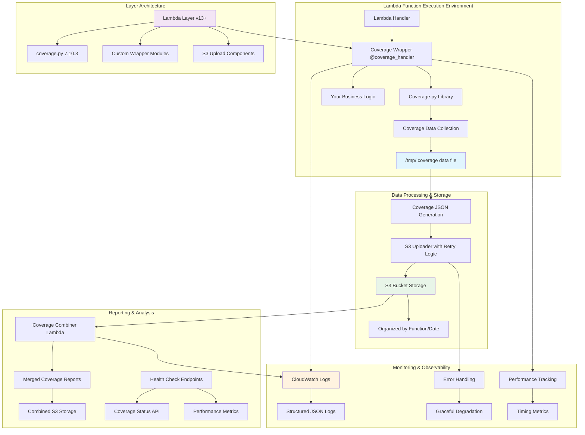
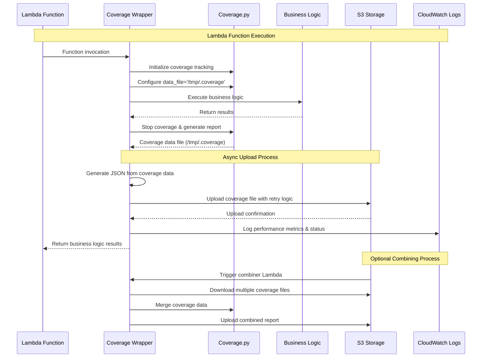

# Lambda Coverage Layer

A Python Lambda layer that provides automated code coverage tracking for AWS Lambda functions. This layer integrates the Python `coverage.py` package to collect coverage data during function execution, automatically uploads coverage reports to S3, and provides utilities for combining multiple coverage reports into consolidated reports.

## Features

- **Automatic Coverage Tracking**: Use decorators or context managers to track code coverage
- **S3 Integration**: Automatic upload of coverage files to S3 with configurable naming
- **Coverage Combining**: Utilities to merge multiple coverage files into consolidated reports

## How It Works

The Lambda Coverage Layer provides a seamless way to collect code coverage data from your Lambda functions without modifying your business logic. Here's how the solution works:

### High-Level Architecture



### Execution Flow



### Solution Components

#### 1. **Lambda Layer**

- **Purpose**: Provides coverage tracking capabilities to any Lambda function
- **Contents**: Python coverage.py library + custom wrapper modules
- **Deployment**: Shared across multiple Lambda functions in your account

#### 2. **Coverage Wrapper**

- **Decorator Pattern**: `@coverage_handler` - Automatic coverage for entire function
- **Context Manager**: `CoverageContext()` - Selective coverage for specific code blocks
- **Initialization**: Configures coverage.py with environment-based settings

#### 3. **Data Collection & Upload**

- **Real-time Tracking**: Collects line and branch coverage during execution
- **Automatic Upload**: Sends coverage files to S3 after function completion
- **Retry Logic**: Handles network failures with exponential backoff
- **Fallback Storage**: Local storage when S3 upload fails

#### 4. **Coverage Combining**

- **Multi-Function Reports**: Combines coverage from multiple Lambda executions
- **Scheduled Processing**: Can be triggered by CloudWatch Events or S3 events
- **Data Validation**: Ensures coverage file integrity before merging

### Data Flow Patterns

#### Pattern 1: Automatic Coverage (Decorator)

```python
@coverage_handler  # Wraps entire function
def lambda_handler(event, context):
    return process_request(event)  # All code tracked
```

#### Pattern 2: Selective Coverage (Context Manager)

```python
def lambda_handler(event, context):
    setup_resources()  # Not tracked

    with CoverageContext():  # Only this block tracked
        result = core_business_logic(event)

    cleanup_resources()  # Not tracked
    return result
```

## Quick Start

### 1. Build and Deploy Infrastructure

```bash
# Install dependencies and build the layer
make install-deps
make build

# Deploy the complete infrastructure (S3 bucket, layer, example functions)
make cdk-deploy

# Or deploy just the layer to AWS (us-east-1 only)
make deploy
```

This creates:

- **Lambda Layer**: Contains coverage.py and wrapper modules
- **S3 Bucket**: Stores individual and combined coverage reports
- **IAM Roles**: Proper permissions for Lambda functions to access S3
- **Example Functions**: Demonstrates different usage patterns

### 2. Add Layer to Your Lambda Function

#### Option A: Using AWS Console

1. Go to your Lambda function in AWS Console
2. Scroll to "Layers" section
3. Click "Add a layer"
4. Select "Custom layers" and choose "lambda-coverage-layer"

#### Option B: Using CDK/CloudFormation

```typescript
const myFunction = new lambda.Function(this, "MyFunction", {
  // ... other properties
  layers: [
    lambda.LayerVersion.fromLayerVersionArn(
      this,
      "CoverageLayer",
      "arn:aws:lambda:region:account:layer:lambda-coverage-layer:version"
    ),
  ],
});
```

#### Option C: Using AWS CLI

```bash
aws lambda update-function-configuration \
  --function-name my-function \
  --layers arn:aws:lambda:region:account:layer:lambda-coverage-layer:version
```

### 3. Update Your Lambda Function Code

```python
from coverage_wrapper import coverage_handler

@coverage_handler
def lambda_handler(event, context):
    # Your existing Lambda function code here
    return {"statusCode": 200, "body": "Hello World"}
```

### 4. Configure Environment Variables

Set these environment variables in your Lambda function:

```bash
COVERAGE_S3_BUCKET=your-coverage-bucket-name
COVERAGE_S3_PREFIX=coverage/
COVERAGE_LOG_LEVEL=INFO
```

### 5. Test and Monitor

```bash
# Invoke your function
aws lambda invoke --function-name my-function response.json

# Check S3 for coverage files
aws s3 ls s3://your-coverage-bucket/coverage/

# View logs in CloudWatch
aws logs tail /aws/lambda/my-function --follow
```

## Deployment Guide

### Step-by-Step Deployment Instructions

#### Step 1: Prerequisites Setup

Ensure you have the required tools and permissions:

```bash
# Verify AWS CLI is configured
aws sts get-caller-identity

# Check Python version (3.8+ required)
python3 --version

# Install AWS CDK v2 (if not already installed)
npm install -g aws-cdk

# Verify CDK installation
cdk --version
```

#### Step 2: Clone and Build the Layer

```bash
# Clone the repository
git clone <repository-url>
cd lambda-coverage-layer

# Install development dependencies
make install-deps

# Build the Lambda layer package
make build

# Validate the built layer
make validate
```

#### Step 3: Deploy Infrastructure

Choose one of the following deployment options:

##### Option A: Complete Infrastructure (Recommended for Testing)

Deploy everything including S3 bucket, layer, and example functions:

```bash
# Deploy complete infrastructure
make cdk-deploy

# This creates:
# - Lambda layer (lambda-coverage-layer)
# - S3 bucket for coverage storage
# - Example Lambda functions with coverage enabled
# - IAM roles with proper permissions
```

##### Option B: Layer-Only Deployment

Deploy just the layer to use with existing infrastructure:

```bash
# Deploy only the layer to us-east-1
make deploy

# For other regions, specify the region:
aws lambda publish-layer-version \
  --layer-name lambda-coverage-layer \
  --zip-file fileb://dist/lambda-coverage-layer-latest.zip \
  --compatible-runtimes python3.8 python3.9 python3.10 python3.11 python3.12 \
  --region us-west-2
```

#### Step 4: Get Layer ARN

After deployment, get the layer ARN for use in your functions:

```bash
# Get the latest layer version ARN
aws lambda list-layer-versions \
  --layer-name lambda-coverage-layer \
  --region us-east-1 \
  --query 'LayerVersions[0].LayerVersionArn' \
  --output text
```

#### Step 5: Configure Your Lambda Functions

Add the layer to your existing Lambda functions:

```bash
# Using AWS CLI
aws lambda update-function-configuration \
  --function-name your-function-name \
  --layers arn:aws:lambda:us-east-1:ACCOUNT:layer:lambda-coverage-layer:VERSION

# Set required environment variables
aws lambda update-function-configuration \
  --function-name your-function-name \
  --environment Variables='{
    "COVERAGE_S3_BUCKET":"your-coverage-bucket",
    "COVERAGE_S3_PREFIX":"coverage/",
    "COVERAGE_LOG_LEVEL":"INFO"
  }'
```

## Quick Reference

### Essential Make Commands

```bash
# Setup and Build
make help           # Show all available commands
make install-deps   # Install development dependencies
make build          # Build the Lambda layer package
make validate       # Validate the built layer package

# Deployment
make deploy         # Deploy layer to AWS (us-east-1 only)
make cdk-deploy     # Deploy complete infrastructure (S3, layer, examples)
make cdk-destroy    # Destroy CDK infrastructure

# Testing and Load Testing
make test           # Run unit tests
make load-test      # Run standard load test (2 iterations, 3 workers)
make load-test-quick # Run quick load test (1 iteration, 2 workers)
make load-test-full # Run comprehensive load test (5 iterations, 5 workers)
make test-status    # Show testing infrastructure status

# Development
make clean          # Clean build artifacts
make dev-build      # Clean, build, and validate
make version        # Show current version
```

### Key Environment Variables

```bash
# Required for Lambda functions using the layer
COVERAGE_S3_BUCKET=your-coverage-bucket-name
COVERAGE_S3_PREFIX=coverage/
COVERAGE_LOG_LEVEL=INFO

# Optional configuration
COVERAGE_UPLOAD_TIMEOUT=30
COVERAGE_BRANCH_COVERAGE=true
COVERAGE_INCLUDE_PATTERNS=src/*,lib/*
COVERAGE_EXCLUDE_PATTERNS=tests/*,vendor/*
```

### Function Names After CDK Deployment

After running `make cdk-deploy`, you'll get these example functions:

```bash
# Simple coverage example
LambdaCoverageLayerStack-SimpleCoverageExample13DE-JBHKwSZvKw9C

# Health check example  
LambdaCoverageLayerStack-HealthCheckExample60A2B0E-YLBpgA2a1glR

# Coverage combiner function
LambdaCoverageLayerStack-CoverageCombiner1F4D726E-9QDrjAFUmYAh

# S3 bucket name
lambdacoveragelayerstack-coveragebucket38435783-xnf0eqfoisay
```

### Quick Test Commands

```bash
# Test simple function
aws lambda invoke \
  --function-name "LambdaCoverageLayerStack-SimpleCoverageExample13DE-JBHKwSZvKw9C" \
  --payload "$(echo '{"name": "TestUser"}' | base64)" \
  --region us-east-1 response.json

# Check S3 for coverage files
aws s3 ls s3://lambdacoveragelayerstack-coveragebucket38435783-xnf0eqfoisay/coverage/ --recursive

# View recent logs
aws logs tail /aws/lambda/LambdaCoverageLayerStack-SimpleCoverageExample13DE-JBHKwSZvKw9C --since 10m
```

## Real-World Deployment Example

Here's a complete walkthrough using the actual function names and resources created by the CDK deployment:

### Step 1: Deploy the Infrastructure

```bash
# Clone and build
git clone <repository-url>
cd lambda-coverage-layer
make install-deps
make build

# Deploy complete infrastructure
make cdk-deploy
```

### Step 2: Test the Deployed Functions

After deployment, test the example functions that were created:

```bash
# Test the simple coverage function
aws lambda invoke \
  --function-name "LambdaCoverageLayerStack-SimpleCoverageExample13DE-JBHKwSZvKw9C" \
  --payload "$(echo '{"name": "ProductionTest"}' | base64)" \
  --region us-east-1 \
  simple_response.json

# Test the health check function
aws lambda invoke \
  --function-name "LambdaCoverageLayerStack-HealthCheckExample60A2B0E-YLBpgA2a1glR" \
  --payload "$(echo '{"path": "/health"}' | base64)" \
  --region us-east-1 \
  health_response.json

# View the responses
echo "Simple function response:"
cat simple_response.json | jq '.'

echo "Health check response:"
cat health_response.json | jq '.'
```

### Step 3: Verify Coverage Files in S3

```bash
# List all coverage files in the deployed S3 bucket
aws s3 ls s3://lambdacoveragelayerstack-coveragebucket38435783-xnf0eqfoisay/coverage/ --recursive --human-readable

# Download and examine a coverage file
LATEST_FILE=$(aws s3 ls s3://lambdacoveragelayerstack-coveragebucket38435783-xnf0eqfoisay/coverage/ --recursive | sort | tail -1 | awk '{print $4}')
aws s3 cp s3://lambdacoveragelayerstack-coveragebucket38435783-xnf0eqfoisay/$LATEST_FILE /tmp/example_coverage.json

# View coverage summary
echo "Coverage file content:"
cat /tmp/example_coverage.json | jq '.files | to_entries[] | {
  file: .key,
  covered_lines: .value.summary.covered_lines,
  total_statements: .value.summary.num_statements,
  coverage_percent: .value.summary.percent_covered_display
}'
```

### Step 4: Monitor Performance

```bash
# Check CloudWatch logs for performance metrics
aws logs tail /aws/lambda/LambdaCoverageLayerStack-SimpleCoverageExample13DE-JBHKwSZvKw9C --since 5m | \
  grep -E "(Performance|coverage|S3)"

# Get the layer ARN for use in your own functions
aws lambda list-layer-versions \
  --layer-name lambda-coverage-layer \
  --region us-east-1 \
  --query 'LayerVersions[0].LayerVersionArn' \
  --output text
```

### Step 5: Add to Your Own Functions

```bash
# Get the layer ARN from the deployment
LAYER_ARN=$(aws lambda list-layer-versions \
  --layer-name lambda-coverage-layer \
  --region us-east-1 \
  --query 'LayerVersions[0].LayerVersionArn' \
  --output text)

echo "Layer ARN: $LAYER_ARN"

# Add the layer to your existing function
aws lambda update-function-configuration \
  --function-name your-existing-function \
  --layers "$LAYER_ARN"

# Set the required environment variables
aws lambda update-function-configuration \
  --function-name your-existing-function \
  --environment Variables='{
    "COVERAGE_S3_BUCKET":"lambdacoveragelayerstack-coveragebucket38435783-xnf0eqfoisay",
    "COVERAGE_S3_PREFIX":"coverage/your-function/",
    "COVERAGE_LOG_LEVEL":"INFO"
  }'
```

### Expected Results

After following these steps, you should see:

- **Coverage files in S3**: Files with names like `20250814_203939_635_2025_08_14___LATEST_*.coverage`
- **File sizes**: ~2KB for simple functions, ~4KB for more complex functions
- **Performance impact**: 200-500ms additional execution time for coverage processing
- **CloudWatch logs**: Structured JSON logs showing coverage operations and S3 uploads

## Load Testing and Verification

### Running Load Tests

The project includes comprehensive load testing capabilities to verify coverage collection:

#### Step 1: Deploy Test Infrastructure

```bash
# Deploy test functions and infrastructure
make cdk-deploy

# Verify deployment status
make test-status
```

#### Step 2: Run Load Tests

```bash
# Quick load test (1 iteration, 2 workers)
make load-test-quick

# Standard load test (2 iterations, 3 workers)
make load-test

# Comprehensive load test (5 iterations, 5 workers)
make load-test-full

# Custom load test
python3 load_test.py \
  --functions "function1,function2,function3" \
  --bucket "your-coverage-bucket" \
  --iterations 3 \
  --workers 2
```

#### Step 3: Manual Function Testing

Test individual functions to generate coverage files:

```bash
# Test simple coverage function
aws lambda invoke \
  --function-name "LambdaCoverageLayerStack-SimpleCoverageExample13DE-JBHKwSZvKw9C" \
  --payload "$(echo '{"name": "TestUser"}' | base64)" \
  --region us-east-1 \
  response.json

# Test health check function
aws lambda invoke \
  --function-name "LambdaCoverageLayerStack-HealthCheckExample60A2B0E-YLBpgA2a1glR" \
  --payload "$(echo '{"path": "/health"}' | base64)" \
  --region us-east-1 \
  health_response.json
```

### Coverage Verification

#### Step 1: Check S3 Coverage Files

Verify that coverage files are being generated and uploaded:

```bash
# List all coverage files
aws s3 ls s3://your-coverage-bucket/coverage/ --recursive --human-readable

# Check recent coverage files (last 10 minutes)
aws s3 ls s3://your-coverage-bucket/coverage/ --recursive | \
  awk '$1" "$2 > "'$(date -u -d '10 minutes ago' '+%Y-%m-%d %H:%M')'"'

# Download and examine a coverage file
aws s3 cp s3://your-coverage-bucket/coverage/path/to/file.coverage /tmp/coverage.json
cat /tmp/coverage.json | jq '.'
```

#### Step 2: Monitor CloudWatch Logs

Check Lambda execution logs for coverage operations:

```bash
# View recent logs with coverage information
aws logs tail /aws/lambda/your-function-name --since 10m --region us-east-1 | \
  grep -E "(coverage|S3|upload|Performance)"

# Filter for coverage-specific log entries
aws logs filter-log-events \
  --log-group-name /aws/lambda/your-function-name \
  --filter-pattern "coverage" \
  --start-time $(date -d '1 hour ago' +%s)000 \
  --region us-east-1
```

#### Step 3: Verify Coverage Data Quality

Examine coverage file content to ensure data quality:

```bash
# Download a recent coverage file
LATEST_FILE=$(aws s3 ls s3://your-coverage-bucket/coverage/ --recursive | \
  sort | tail -1 | awk '{print $4}')

aws s3 cp s3://your-coverage-bucket/$LATEST_FILE /tmp/latest_coverage.json

# Check coverage file structure and content
echo "File size: $(ls -lh /tmp/latest_coverage.json | awk '{print $5}')"
echo "Coverage summary:"
cat /tmp/latest_coverage.json | jq '.files | to_entries[] | {
  file: .key,
  covered_lines: .value.summary.covered_lines,
  total_statements: .value.summary.num_statements,
  coverage_percent: .value.summary.percent_covered_display
}'
```

### Performance Monitoring

#### Expected Performance Metrics

Monitor these key performance indicators:

```bash
# Coverage initialization time: ~50-150ms
# Coverage finalization time: ~60-120ms  
# S3 upload time: ~200-500ms (varies by network)
# Total overhead: ~300-800ms per invocation
# Memory overhead: ~30-70MB
```

#### Performance Verification Script

```bash
#!/bin/bash
# performance_check.sh - Monitor coverage performance

FUNCTION_NAME="your-function-name"
LOG_GROUP="/aws/lambda/$FUNCTION_NAME"

echo "Checking performance metrics for $FUNCTION_NAME..."

# Get recent performance logs
aws logs filter-log-events \
  --log-group-name "$LOG_GROUP" \
  --filter-pattern "Performance" \
  --start-time $(date -d '1 hour ago' +%s)000 \
  --region us-east-1 \
  --query 'events[].message' \
  --output text | \
  grep -E "(coverage_initialization|coverage_finalization|s3_upload)" | \
  jq -r '. | "\(.operation): \(.duration_ms)ms"'
```

### Coverage Combining

Combine multiple coverage files into consolidated reports:

```python
from coverage_wrapper import coverage_handler, combine_coverage_files
import os
import json

@coverage_handler
def coverage_combiner_handler(event, context):
    result = combine_coverage_files(
        bucket_name=os.environ['COVERAGE_S3_BUCKET'],
        prefix='coverage/',
        output_key='coverage/combined/daily-report.json'
    )
    return {'statusCode': 200, 'body': json.dumps(result)}
```

### Real-World Implementation Examples

#### E-commerce Microservices

```python
# Order processing service
@coverage_handler
def process_order_handler(event, context):
    order = validate_order(event['order'])
    payment = process_payment(order)
    inventory = update_inventory(order)
    return create_order_response(order, payment, inventory)

# Inventory service with selective coverage
def inventory_handler(event, context):
    # Skip coverage for initialization
    setup_database_connection()

    # Track only business logic
    with CoverageContext():
        if event['action'] == 'check':
            return check_inventory(event['items'])
        elif event['action'] == 'update':
            return update_inventory(event['items'])
```

#### API Gateway with Health Checks

```python
@coverage_handler
def api_gateway_handler(event, context):
    # Built-in health check endpoint
    if event.get('path') == '/health':
        return {
            'statusCode': 200,
            'body': json.dumps(health_check_handler())
        }

    # Route to business logic
    if event['httpMethod'] == 'GET':
        return handle_get_request(event)
    elif event['httpMethod'] == 'POST':
        return handle_post_request(event)
```

#### Scheduled Coverage Reports

```python
# CloudWatch Events trigger this daily
@coverage_handler
def daily_coverage_report(event, context):
    """Combines yesterday's coverage files into daily report"""
    from datetime import datetime, timedelta

    yesterday = datetime.now() - timedelta(days=1)
    prefix = f"coverage/{yesterday.strftime('%Y/%m/%d')}/"

    result = combine_coverage_files(
        bucket_name=os.environ['COVERAGE_S3_BUCKET'],
        prefix=prefix,
        output_key=f"coverage/daily/{yesterday.strftime('%Y-%m-%d')}.json"
    )

    # Send to monitoring system
    send_coverage_metrics(result)
    return result
```

## Configuration

### Environment Variables

| Variable                    | Required | Default     | Description                             |
| --------------------------- | -------- | ----------- | --------------------------------------- |
| `COVERAGE_S3_BUCKET`        | Yes      | -           | S3 bucket for coverage file uploads     |
| `COVERAGE_S3_PREFIX`        | No       | `coverage/` | S3 key prefix for coverage files        |
| `COVERAGE_UPLOAD_TIMEOUT`   | No       | `30`        | Upload timeout in seconds               |
| `COVERAGE_INCLUDE_PATTERNS` | No       | -           | Comma-separated patterns to include     |
| `COVERAGE_EXCLUDE_PATTERNS` | No       | -           | Comma-separated patterns to exclude     |
| `COVERAGE_BRANCH_COVERAGE`  | No       | `true`      | Enable branch coverage tracking         |
| `COVERAGE_LOG_LEVEL`        | No       | `INFO`      | Log level (DEBUG, INFO, WARNING, ERROR) |

### IAM Permissions

Your Lambda execution role needs the following permissions:

```json
{
  "Version": "2012-10-17",
  "Statement": [
    {
      "Effect": "Allow",
      "Action": ["s3:PutObject", "s3:GetObject", "s3:ListBucket"],
      "Resource": [
        "arn:aws:s3:::your-coverage-bucket/*",
        "arn:aws:s3:::your-coverage-bucket"
      ]
    }
  ]
}
```

## Examples

See the [examples](./examples/) directory for comprehensive usage examples:

- **[Simple Function](./examples/simple_function/)**: Basic decorator usage
- **[Context Manager](./examples/context_manager_function/)**: Manual coverage control
- **[Health Check](./examples/health_check_function/)**: API Gateway integration
- **[Coverage Combiner](./examples/combiner_function/)**: Consolidating reports
- **[Advanced Usage](./examples/advanced_usage/)**: Performance optimization patterns

## API Reference

### Decorators

#### `@coverage_handler`

Automatically wraps your Lambda handler with coverage tracking.

```python
@coverage_handler
def lambda_handler(event, context):
    return response
```

### Context Managers

#### `CoverageContext`

Provides manual control over coverage tracking.

```python
with CoverageContext():
    # Code tracked for coverage
    result = business_logic()
```

### Functions

#### `health_check_handler()`

Returns health status including coverage information.

```python
from coverage_wrapper import health_check_handler

status = health_check_handler()
# Returns: {"status": "healthy", "coverage_enabled": true, ...}
```

#### `combine_coverage_files(bucket_name, prefix, output_key)`

Combines multiple coverage files into a single report.

```python
from coverage_wrapper import combine_coverage_files

result = combine_coverage_files(
    bucket_name="my-bucket",
    prefix="coverage/2024/01/15/",
    output_key="coverage/combined/report.json"
)
```

## Performance

### Cold Start Impact

| Usage Pattern       | Additional Cold Start Time |
| ------------------- | -------------------------- |
| `@coverage_handler` | ~200-500ms                 |
| `CoverageContext`   | ~50-100ms                  |
| No coverage         | 0ms                        |

### Memory Overhead

| Component         | Memory Usage |
| ----------------- | ------------ |
| Coverage tracking | ~20-50MB     |
| File upload       | ~10-20MB     |
| Total overhead    | ~30-70MB     |

### Optimization Tips

1. **Use context managers for performance-critical functions**
2. **Exclude initialization/cleanup code from coverage**
3. **Use selective coverage for batch processing**
4. **Monitor memory usage and adjust Lambda memory allocation**

## Troubleshooting

### Common Implementation Issues

#### Coverage files not uploaded to S3

**Symptoms**: Function executes successfully but no coverage files appear in S3

**Solutions**:

1. **Check IAM permissions**:

   ```bash
   # Verify your Lambda execution role has S3 permissions
   aws iam get-role-policy --role-name your-lambda-role --policy-name S3Access
   ```

2. **Verify environment variables**:

   ```bash
   # Check Lambda configuration
   aws lambda get-function-configuration --function-name your-function
   ```

3. **Check CloudWatch logs**:
   ```bash
   # Look for S3 upload errors
   aws logs filter-log-events --log-group-name /aws/lambda/your-function \
     --filter-pattern "S3 upload"
   ```

#### High cold start times

**Symptoms**: Lambda functions taking 500ms+ longer to start

**Solutions**:

1. **Use selective coverage for performance-critical functions**:

   ```python
   def lambda_handler(event, context):
       # Fast initialization (not tracked)
       setup_connections()

       # Only track critical business logic
       with CoverageContext():
           return process_request(event)
   ```

2. **Optimize imports**:

   ```python
   # Import coverage_wrapper only when needed
   if os.environ.get('COVERAGE_ENABLED', 'false') == 'true':
       from coverage_wrapper import coverage_handler
   else:
       coverage_handler = lambda f: f  # No-op decorator
   ```

3. **Use provisioned concurrency for critical functions**:
   ```bash
   aws lambda put-provisioned-concurrency-config \
     --function-name your-function \
     --provisioned-concurrency-config AllocatedProvisionedConcurrencyUnits=10
   ```

#### Memory issues

**Symptoms**: Lambda functions running out of memory or increased memory usage

**Solutions**:

1. **Monitor memory usage patterns**:

   ```python
   # Add memory monitoring to your function
   import psutil

   @coverage_handler
   def lambda_handler(event, context):
       initial_memory = psutil.virtual_memory().used
       result = your_business_logic(event)
       final_memory = psutil.virtual_memory().used
       print(f"Memory used: {final_memory - initial_memory} bytes")
       return result
   ```

2. **Use selective coverage for large codebases**:

   ```python
   # Only track specific modules
   os.environ['COVERAGE_INCLUDE_PATTERNS'] = 'src/core/*,src/business/*'
   os.environ['COVERAGE_EXCLUDE_PATTERNS'] = 'src/vendor/*,tests/*'
   ```

3. **Increase Lambda memory allocation**:
   ```bash
   aws lambda update-function-configuration \
     --function-name your-function \
     --memory-size 512  # Increase from 256MB
   ```

### Performance Optimization

#### Sampling for High-Volume Functions

```python
import random

def lambda_handler(event, context):
    # Only collect coverage for 1% of invocations
    if random.random() < 0.01:
        with CoverageContext():
            return process_request(event)
    else:
        return process_request(event)
```

#### Environment-Based Coverage

```python
import os

# Only enable coverage in development/staging
ENABLE_COVERAGE = os.environ.get('STAGE') in ['dev', 'staging']

if ENABLE_COVERAGE:
    from coverage_wrapper import coverage_handler
else:
    coverage_handler = lambda f: f  # No-op decorator

@coverage_handler
def lambda_handler(event, context):
    return process_request(event)
```

### Debug Mode

Enable debug logging by setting the log level:

```python
import os
os.environ['COVERAGE_LOG_LEVEL'] = 'DEBUG'
```

Or set it as an environment variable in your Lambda configuration:

```bash
COVERAGE_LOG_LEVEL=DEBUG
```

### Log Analysis

Coverage operations are logged with structured JSON:

```json
{
  "level": "INFO",
  "message": "Coverage file uploaded successfully",
  "s3_key": "coverage/2024/01/15/my-function-abc123.coverage",
  "file_size": 1024,
  "upload_time_ms": 150
}
```

## Development

### Available Make Commands

```bash
# Setup and building
make help           # Show all available commands
make dev-setup      # Install dependencies and setup development environment
make build          # Build the Lambda layer package
make validate       # Validate the built layer package
make clean          # Clean build artifacts

# Testing
make test           # Run tests with coverage report
make dev-test       # Run tests and validation

# Deployment
make deploy         # Deploy layer to AWS (us-east-1 only)
make cdk-synth      # Synthesize CDK stack
make cdk-deploy     # Deploy CDK infrastructure
make cdk-destroy    # Destroy CDK infrastructure

# Version management
make version        # Show current version
make bump-patch     # Bump patch version
make bump-minor     # Bump minor version
make bump-major     # Bump major version

# Development workflows
make dev-build      # Clean, build, and validate
make release-patch  # Bump patch version, build, and validate
```

### Building the Layer

```bash
# Install development dependencies
make install-deps

# Build the layer package
make build

# Validate the layer
make validate
```

### Running Tests

#### Unit Tests
```bash
# Run unit tests with coverage report
make test

# Clean build artifacts
make clean

# Full development workflow
make dev-build
```

#### Integration Testing with CDK

The project includes comprehensive CDK-based testing infrastructure:

```bash
# 1. Build and deploy the layer
make build
make deploy

# 2. Deploy testing infrastructure (replace with your layer ARN)
make test-deploy LAYER_ARN=arn:aws:lambda:us-east-1:ACCOUNT:layer:lambda-coverage-layer:VERSION

# 3. Run load tests
make load-test        # Standard load test (2 iterations)
make load-test-quick  # Quick test (1 iteration)
make load-test-full   # Comprehensive test (5 iterations)

# 4. Check deployment status
make test-status

# 5. Complete workflow (build + deploy + test)
make test-all LAYER_ARN=arn:aws:lambda:us-east-1:ACCOUNT:layer:lambda-coverage-layer:VERSION

# 6. Cleanup testing infrastructure
make test-destroy
```

The testing infrastructure deploys:
- **Main Test Function**: Comprehensive Lambda with multiple operations (add, multiply, divide, random, health, complex, async)
- **Simple Test Function**: Basic Lambda for simple coverage testing
- **Error Test Function**: Lambda for testing error handling and edge cases
- **S3 Bucket**: For storing coverage reports with lifecycle policies
- **IAM Roles**: Proper permissions for S3 access and Lambda execution

Load tests exercise different code paths and generate coverage reports that are uploaded to S3.

### Contributing

1. Fork the repository
2. Create a feature branch
3. Make your changes
4. Add tests for new functionality
5. Run the test suite
6. Submit a pull request

## License

This project is licensed under the MIT License - see the [LICENSE](LICENSE) file for details.

## Support

For issues and questions:

1. Check the [troubleshooting section](#troubleshooting)
2. Review the [examples](./examples/)
3. Check CloudWatch logs
4. Open an issue on GitHub

## Changelog

See [CHANGELOG.md](CHANGELOG.md) for version history and changes.
