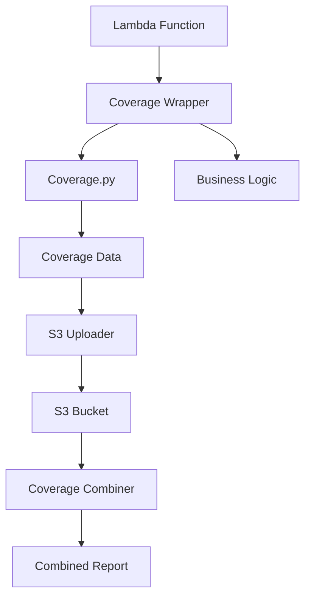

# Lambda Coverage Layer

A Python Lambda layer that provides automated code coverage tracking for AWS Lambda functions. This layer integrates the Python `coverage.py` package to collect coverage data during function execution, automatically uploads coverage reports to S3, and provides utilities for combining multiple coverage reports into consolidated reports.

## Features

- **Automatic Coverage Tracking**: Use decorators or context managers to track code coverage
- **S3 Integration**: Automatic upload of coverage files to S3 with configurable naming
- **Health Check Support**: Built-in health check endpoints with coverage status
- **Coverage Combining**: Utilities to merge multiple coverage files into consolidated reports
- **Performance Optimized**: Minimal cold start impact and memory overhead
- **Multiple Usage Patterns**: Support for both automatic and manual coverage control

## Quick Start

### 1. Deploy the Layer

```bash
# Build and deploy the layer
make build-layer
make deploy-layer
```

### 2. Use in Your Lambda Function

```python
from coverage_wrapper import coverage_handler

@coverage_handler
def lambda_handler(event, context):
    # Your Lambda function code here
    return {"statusCode": 200, "body": "Hello World"}
```

### 3. Configure Environment Variables

```bash
COVERAGE_S3_BUCKET=your-coverage-bucket
COVERAGE_S3_PREFIX=coverage/
```

## Installation

### Prerequisites

- Python 3.8+
- AWS CLI configured
- AWS CDK (for infrastructure deployment)

### Build from Source

```bash
# Clone the repository
git clone <repository-url>
cd lambda-coverage-layer

# Install dependencies
pip install -r requirements-dev.txt

# Build the layer
make build-layer

# Deploy infrastructure
cdk deploy
```

## Usage

### Basic Usage with Decorator

The simplest way to add coverage tracking to your Lambda function:

```python
from coverage_wrapper import coverage_handler

@coverage_handler
def lambda_handler(event, context):
    # All your code is automatically tracked
    name = event.get('name', 'World')
    return {
        'statusCode': 200,
        'body': f'Hello, {name}!'
    }
```

### Manual Control with Context Manager

For fine-grained control over what code is tracked:

```python
from coverage_wrapper import CoverageContext

def lambda_handler(event, context):
    # Initialization code (not tracked)
    setup_resources()
    
    # Business logic (tracked)
    with CoverageContext():
        result = process_business_logic(event)
    
    # Cleanup code (not tracked)
    cleanup_resources()
    
    return result
```

### Health Check Integration

Add health check endpoints to your Lambda functions:

```python
from coverage_wrapper import coverage_handler
from coverage_wrapper.health_check import health_check_handler

@coverage_handler
def lambda_handler(event, context):
    if event.get('path') == '/health':
        return {
            'statusCode': 200,
            'body': json.dumps(health_check_handler())
        }
    
    # Regular business logic
    return handle_request(event, context)
```

### Coverage Combining

Combine multiple coverage files into consolidated reports:

```python
from coverage_wrapper import coverage_handler
from coverage_wrapper.combiner import combine_coverage_files

@coverage_handler
def coverage_combiner_handler(event, context):
    result = combine_coverage_files(
        bucket_name=os.environ['COVERAGE_S3_BUCKET'],
        prefix='coverage/',
        output_key='coverage/combined/daily-report.json'
    )
    return {'statusCode': 200, 'body': json.dumps(result)}
```

## Configuration

### Environment Variables

| Variable | Required | Default | Description |
|----------|----------|---------|-------------|
| `COVERAGE_S3_BUCKET` | Yes | - | S3 bucket for coverage file uploads |
| `COVERAGE_S3_PREFIX` | No | `coverage/` | S3 key prefix for coverage files |
| `COVERAGE_UPLOAD_TIMEOUT` | No | `30` | Upload timeout in seconds |
| `COVERAGE_INCLUDE_PATTERNS` | No | - | Comma-separated patterns to include |
| `COVERAGE_EXCLUDE_PATTERNS` | No | - | Comma-separated patterns to exclude |
| `COVERAGE_BRANCH_COVERAGE` | No | `true` | Enable branch coverage tracking |

### IAM Permissions

Your Lambda execution role needs the following permissions:

```json
{
    "Version": "2012-10-17",
    "Statement": [
        {
            "Effect": "Allow",
            "Action": [
                "s3:PutObject",
                "s3:GetObject",
                "s3:ListBucket"
            ],
            "Resource": [
                "arn:aws:s3:::your-coverage-bucket/*",
                "arn:aws:s3:::your-coverage-bucket"
            ]
        }
    ]
}
```

## Examples

See the [examples](./examples/) directory for comprehensive usage examples:

- **[Simple Function](./examples/simple_function/)**: Basic decorator usage
- **[Context Manager](./examples/context_manager_function/)**: Manual coverage control
- **[Health Check](./examples/health_check_function/)**: API Gateway integration
- **[Coverage Combiner](./examples/combiner_function/)**: Consolidating reports
- **[Advanced Usage](./examples/advanced_usage/)**: Performance optimization patterns

## API Reference

### Decorators

#### `@coverage_handler`

Automatically wraps your Lambda handler with coverage tracking.

```python
@coverage_handler
def lambda_handler(event, context):
    return response
```

### Context Managers

#### `CoverageContext`

Provides manual control over coverage tracking.

```python
with CoverageContext():
    # Code tracked for coverage
    result = business_logic()
```

### Functions

#### `health_check_handler()`

Returns health status including coverage information.

```python
from coverage_wrapper.health_check import health_check_handler

status = health_check_handler()
# Returns: {"status": "healthy", "coverage_enabled": true, ...}
```

#### `combine_coverage_files(bucket_name, prefix, output_key)`

Combines multiple coverage files into a single report.

```python
from coverage_wrapper.combiner import combine_coverage_files

result = combine_coverage_files(
    bucket_name="my-bucket",
    prefix="coverage/2024/01/15/",
    output_key="coverage/combined/report.json"
)
```

## Performance

### Cold Start Impact

| Usage Pattern | Additional Cold Start Time |
|---------------|---------------------------|
| `@coverage_handler` | ~200-500ms |
| `CoverageContext` | ~50-100ms |
| No coverage | 0ms |

### Memory Overhead

| Component | Memory Usage |
|-----------|-------------|
| Coverage tracking | ~20-50MB |
| File upload | ~10-20MB |
| Total overhead | ~30-70MB |

### Optimization Tips

1. **Use context managers for performance-critical functions**
2. **Exclude initialization/cleanup code from coverage**
3. **Use selective coverage for batch processing**
4. **Monitor memory usage and adjust Lambda memory allocation**

## Troubleshooting

### Common Issues

#### Coverage files not uploaded to S3

1. Check IAM permissions for S3 access
2. Verify `COVERAGE_S3_BUCKET` environment variable
3. Check CloudWatch logs for error messages

#### High cold start times

1. Consider using `CoverageContext` instead of `@coverage_handler`
2. Optimize imports and initialization code
3. Use provisioned concurrency for critical functions

#### Memory issues

1. Monitor memory usage in CloudWatch
2. Use selective coverage for large codebases
3. Increase Lambda memory allocation if needed

### Debug Mode

Enable debug logging:

```python
import os
os.environ['COVERAGE_DEBUG'] = 'true'
```

### Log Analysis

Coverage operations are logged with structured JSON:

```json
{
    "level": "INFO",
    "message": "Coverage file uploaded successfully",
    "s3_key": "coverage/2024/01/15/my-function-abc123.coverage",
    "file_size": 1024,
    "upload_time_ms": 150
}
```

## Development

### Building the Layer

```bash
# Install development dependencies
pip install -r requirements-dev.txt

# Build the layer package
make build-layer

# Validate the layer
make validate-layer
```

### Running Tests

```bash
# Run unit tests
make test

# Run tests with coverage
make test-coverage

# Run integration tests
make test-integration
```

### Contributing

1. Fork the repository
2. Create a feature branch
3. Make your changes
4. Add tests for new functionality
5. Run the test suite
6. Submit a pull request

## Architecture

### Layer Structure

```
python/
├── coverage/                    # coverage.py package
├── coverage_wrapper/           # Custom wrapper modules
│   ├── __init__.py
│   ├── wrapper.py             # Main coverage wrapper
│   ├── s3_uploader.py         # S3 upload utilities
│   ├── health_check.py        # Health check module
│   ├── combiner.py            # Coverage combining
│   ├── models.py              # Data models
│   └── logging_utils.py       # Logging utilities
└── requirements.txt           # Layer dependencies
```

### Data Flow



## License

This project is licensed under the MIT License - see the [LICENSE](LICENSE) file for details.

## Support

For issues and questions:

1. Check the [troubleshooting section](#troubleshooting)
2. Review the [examples](./examples/)
3. Check CloudWatch logs
4. Open an issue on GitHub

## Changelog

See [CHANGELOG.md](CHANGELOG.md) for version history and changes.
